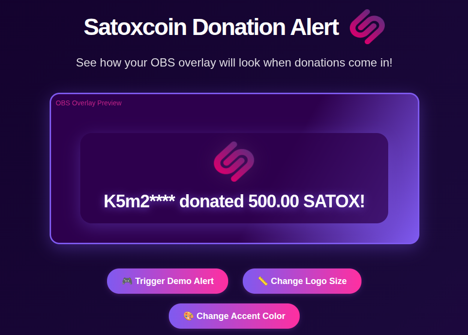

# 🪙 Satoxcoin Stream Donation Overlay

[](https://www.python.org/downloads/)
[](LICENSE)
[](https://github.com/satoverse/satoxcoin-stream-donation-overlay)
[](https://obsproject.com/)
[](https://streamlabs.com/)

A production-ready donation overlay system for receiving Satoxcoin donations during live streams with real-time alerts, animations, and sound effects.

## 🖼️ Demo Preview



*Interactive demo showing the donation overlay in action. Features customizable logo sizes, accent colors, and realistic Satoxcoin addresses.*

## 📋 Table of Contents
- [🚀 Quick Start](#-quick-start)
- [🎮 Interactive Demo Preview](#-interactive-demo-preview)
- [🪟 Windows Setup](#-windows-setup)
- [📚 Documentation](#-documentation)
- [🛠️ Quick Troubleshooting](#️-quick-troubleshooting)
- [🤝 Contributing](#-contributing)
- [📄 License](#-license)

## 🚀 Quick Start

### 1. **Prerequisites**
- Python 3.7+ installed
- Satox Core wallet running with RPC enabled
- OBS Studio, Streamlabs OBS, or compatible streaming software

### 2. **Download & Setup**
```bash
# Clone the repository
git clone https://github.com/satoverse/satoxcoin-stream-donation-overlay.git
cd satoxcoin-stream-donation-overlay

# Install dependencies
pip install -r requirements.txt
```

### 3. **Configure the Monitor**
Edit `wallet_monitor.py`:
```python
# Update these settings:
RPC_USER = "your_rpc_username"
RPC_PASSWORD = "your_rpc_password"  # Your RPC password
RPC_HOST = "127.0.0.1"
RPC_PORT = 7777  # Satoxcoin RPC port

# Your donation wallet address
DONATION_ADDRESS = "your_donation_address_here"

# Minimum donation amount (in Satox)
MIN_DONATION = 1.0
```

### 4. **Set Up Satox Core RPC**
Create `satoxcoin.conf` in your Satox data directory:

**📁 Satoxcoin Data Directory Locations:**

**Windows:**
- `%APPDATA%\satoxcoin\`
- `%APPDATA%\satoxcoin\satoxcoin.conf`

**Linux:**
- `~/.satoxcoin/`
- `~/.satoxcoin/satoxcoin.conf`

**macOS:**
- `~/Library/Application Support/Satoxcoin/`
- `~/Library/Application Support/Satoxcoin/satoxcoin.conf`

**Create the configuration file:**
```ini
server=1
rpcuser=your_username
rpcpassword=your_rpc_password
rpcallowip=127.0.0.1
rpcport=7777
```

**💡 Quick Setup Commands:**
```bash
# Linux/macOS - Create directory and config
mkdir -p ~/.satoxcoin
nano ~/.satoxcoin/satoxcoin.conf

# Windows - Create config (run in Command Prompt)
mkdir "%APPDATA%\satoxcoin"
notepad "%APPDATA%\satoxcoin\satoxcoin.conf"
```

### 5. **Generate Your Donation Address**
You need to create a donation address for receiving SATOX donations:

**🔧 Generate Address Using Satox Core:**
```bash
# Connect to your Satox Core wallet
curl -u your_rpc_username:your_rpc_password http://127.0.0.1:7777 \
  -X POST -H "Content-Type: application/json" \
  -d '{"jsonrpc":"1.0","id":"test","method":"getnewaddress","params":["donation"]}'
```

**📝 Example Response:**
```json
{"result":"SiGAJKZkB7xQdqzKHWRcus9PoLVoXx2occ","error":null,"id":"test"}
```

**💡 Copy the address from the "result" field and use it in your configuration.**

**⚠️ Important:** The default configuration uses a burn address (`SQBurnSatoXAddressXXXXXXXXXXUqEipi`) as a placeholder. You **MUST** replace this with your own donation address before using the system!

### 6. **Test the Setup**
```bash
# Start demo server
python3 -m http.server 8080

# Visit http://localhost:8080/demo.html
# Click "Test Donation" to verify everything works
```

## 🎮 **Interactive Demo Preview**

The demo page provides a complete preview of how your donation alerts will look in OBS. Here's what you'll see:

### 🎯 **Demo Features**
- **🎮 Trigger Demo Alert** - Simulates random donation alerts with different amounts
- **📏 Change Logo Size** - Test 4 different logo sizes (Small, Medium, Large, Extra Large)
- **🎨 Change Accent Color** - Try 5 different color themes (Purple, Pink, Cyan, Rose, Dark Purple)
- **🖼️ Visual Preview** - See exactly how your OBS overlay will look
- **🎵 Sound Effects** - Test audio with coin.mp3 sound file

### ⌨️ **Keyboard Shortcuts**
- **Spacebar** - Trigger demo alert
- **S key** - Change logo size
- **C key** - Change accent color

### 🎨 **Demo Interface**
The demo shows a realistic OBS overlay preview with:
- **Animated Satoverse logo** with bouncing effect
- **Random donation amounts** (25.00, 50.00, 75.50, 100.00, 150.00, 200.00, 250.00, 500.00 SATOX)
- **Privacy-protected addresses** (S8f3****, S7b9****, S1e8****, etc.)
- **Sound effects** with coin.mp3 audio
- **Auto-fade animation** (7 seconds display time)

### 🎯 **Testing Your Setup**
1. **Start the demo server** (see commands above)
2. **Open demo.html** in your browser
3. **Click "Trigger Demo Alert"** to see the overlay in action
4. **Try different sizes and colors** to customize the appearance
5. **Test sound effects** to ensure audio works correctly

The demo automatically triggers on page load, so you'll see an example alert immediately!

### 7. **Start Monitoring**
```bash
python3 wallet_monitor.py
```

### 8. **Add to OBS**
1. Add **Browser Source** in OBS
2. URL: `http://localhost:8080/alert.html`
3. Width: 600px, Height: 300px
4. Enable "Control audio via OBS" (optional)

## 🪟 Windows Setup

### Quick Windows Setup
1. **Extract files** to a folder (e.g., `%USERPROFILE%\Documents\satoxcoin-stream-donation-overlay\`)
2. **Run setup**: Double-click `setup-windows.bat`
3. **Configure**: Edit `wallet_monitor.py` with your settings
4. **Test**: Double-click `start-demo.bat` and visit `http://localhost:8080/demo.html`
5. **Monitor**: Double-click `start-monitor.bat` to begin monitoring

### Windows Files
- `setup-windows.bat` - Initial setup and dependency installation
- `start-monitor.bat` - Start the donation monitor
- `start-demo.bat` - Start local demo server
- `install-service.bat` - Install as Windows service (advanced)
- `check-deps.bat` - Check/install dependencies

## 📁 File Structure

```
satoxcoin-stream-donation-overlay/
├── wallet_monitor.py          # Main monitoring script
├── alert.html                 # OBS overlay file
├── demo.html                  # Demo/test page
├── satox-logo.png            # Logo file
├── coin.mp3                  # Sound effect
├── requirements.txt           # Python dependencies
├── setup-windows.bat          # Windows setup script
├── start-monitor.bat          # Windows monitor script
├── start-demo.bat             # Windows demo script
└── README.md                  # This file
```

## 🎨 Features

### Real-time Alerts
- **Instant notifications** when donations are received
- **Address privacy** - shows "S8f3**** donated 150.00 SATOX!"
- **Customizable minimum amounts**
- **Sound effects** with volume control

### OBS Integration
- **Browser Source compatible** with all streaming software
- **Responsive design** (600x300px)
- **Cross-platform** - works on Windows, Mac, Linux
- **No external dependencies** - pure HTML/CSS/JS

### Security & Privacy
- **Local RPC connection** - no external services
- **Address obfuscation** for donor privacy
- **Secure authentication** with RPC credentials
- **No data collection** - everything stays local

## 🔧 Configuration

### Customization Options
Edit CSS variables in `alert.html`:
```css
:root {
  --accent-color: #6366f1;    /* Primary color */
  --glow-color: #4a1a5f;      /* Glow effect */
  --logo-size: 80px;          /* Logo dimensions */
  --alert-duration: 5s;       /* Display time */
}
```

### Sound Customization
- Replace `coin.mp3` with your own sound file
- Adjust volume in the demo page
- Enable/disable audio in OBS settings

### Monitor Settings
```python
# In wallet_monitor.py
MIN_DONATION = 1.0        # Minimum donation amount
DEBUG = False             # Enable debug logging
CHECK_INTERVAL = 30       # Check frequency (seconds)
```

## 📚 **Documentation**

For detailed guides and troubleshooting, see the **[docs/](docs/)** folder:

- **[🚀 Installation Guide](docs/INSTALLATION.md)** - Complete setup instructions
- **[🪟 Windows Setup](docs/README-WINDOWS.md)** - Windows-specific guide  
- **[🔧 Troubleshooting](docs/TROUBLESHOOTING.md)** - Common issues and solutions

## 🛠️ **Quick Troubleshooting**

### Common Issues

**Python not found**
```bash
# Install Python with "Add to PATH" option
# Verify: python --version
```

**RPC connection failed**
```bash
# Check satoxcoin.conf settings
# Verify Satox Core is running
# Test: curl -u username:password http://127.0.0.1:7777
```

**Port already in use**
```
```
## 🤝 Contributing

We welcome contributions! Here's how you can help:

### 🐛 Reporting Issues
- Use the [GitHub Issues](https://github.com/satoverse/satoxcoin-stream-donation-overlay/issues) page
- Include your operating system and Python version
- Provide error messages and logs

### 💡 Suggesting Features
- Open a [Feature Request](https://github.com/satoverse/satoxcoin-stream-donation-overlay/issues/new) issue
- Describe the use case and benefits
- Include mockups if possible

### �� Code Contributions
1. Fork the repository
2. Create a feature branch: `git checkout -b feature-name`
3. Make your changes
4. Test thoroughly
5. Submit a pull request

### 📋 Development Setup
```bash
# Clone and setup development environment
git clone https://github.com/satoverse/satoxcoin-stream-donation-overlay.git
cd satoxcoin-stream-donation-overlay
pip install -r requirements.txt

# Run tests
python test_all.py
```

## 📄 License

This project is licensed under the MIT License - see the [LICENSE](LICENSE) file for details.

---

**Made with ❤️ for the Satoxcoin community**

[](https://satoxcoin.org/)
[](https://github.com/satoverse/satoxcoin-stream-donation-overlay)
